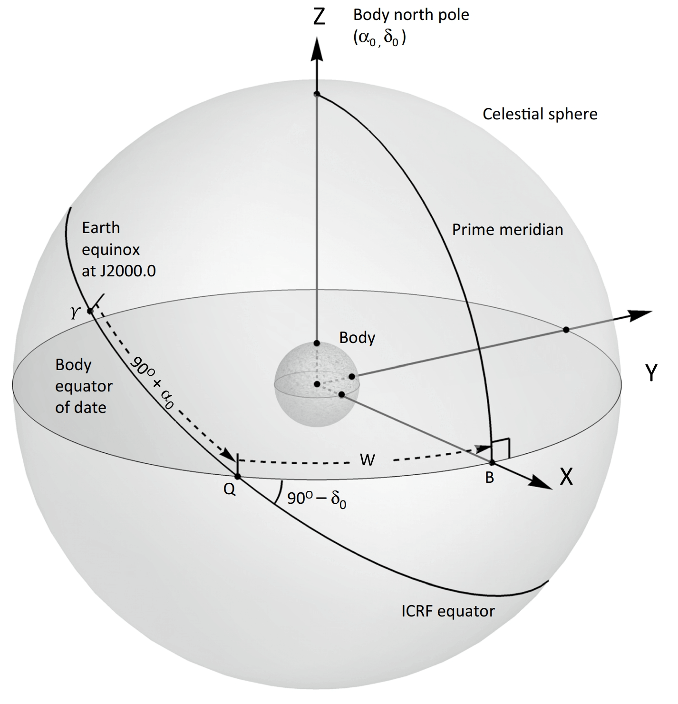

# Initials
**Initials**, that are files containing names, physical parameters, and initial states of celestial bodies, along with parameters for configuring ephemeris integration. This document introduces the format requisitions, folder structures, and parameter definitions.

## SolarSystem

The Solar System at J2000 = JD 2451545.0 TDB (~ 2000. 1. 1 11:58:55.816 UTC). The default and built-in initials used by this program. Should be 

- An example illustrating format of initials;
- An unified source of information about the Solar System.
- A starting point for creating custom celestial systems;

Parameters are collected from (references needed) and fitted to (references needed 2).

- All the state vectors ([orbital](#OrbitalState) and [rotational](#RotationalState)) are expressed in ICRS-**Ecliptic** Frame. That is, ICRS rotated about its X axis (spring equinox) by the IAU76/80 J2000 obliquity of `84381.448 arcsec`, to align with the ecliptic. The state vectors also define the coordinate frame in which ephemerides will be integrated internally, and expressed in output.
- **However,** [rotational angles](#RotationalParam) are defined by IAU in ICRS, that is, an **equatorial** frame. So a rotation of `-84381.448 arcsec` will be applied to these parameters when loading initials.

## Format

- All files should be texts encoded in UTF-8, without BOM.
- Both `'\r'` and `'\n'` are line separator. Empty lines are ignored. The length of one line must less than `constexpr size_t MAX_LINESIZE=1024;` defined in `configs.h`.
- The lines start with `'#'` are comments and ignored. **`'#'` presenting elsewhere than the beginning of a line will not be treated as a comment.**

**Unless otherwise stated:**

- Every line is a list of space(sequence of `'\t'` or `' '`)-separated tokens;
- **All strings (keys, IDs, names) are case-sensitive**;
- **All values (floating points) are in international units**.

## Config File (Required)

This is the first file that program reads. Each line should contain 2 tokens as a key-value pair. No key shall present multiple times.

### Possible keys are:

#### `Initial` (Required), `Extra`
Names of files containing [initial states](#Initial) and [extra parameters](#Extra) of celestial bodies, these files must be in the same directory as the [config file](#Config). `Extra` may be absent if no-body has any extra parameter.

#### `Geopotentials`, `Rings`
Names of folders containing [geopotential model](#Geopotentials) and [ring system](#Rings) of celestial bodies, these folders must be in the same directory as the [config file](#Config). Both may be absent if no-body has geopotential model or ring system.

#### `TDB`
The coordinate time (second) of [initial states](#Initial).

Must be an integer. Defaults to `0` if absent.

Note: TDB (Barycentric Dynamical Time) is the coordinate time scale used for ephemeris of [Solar System](#SolarSystem).

#### `Integrator`
Must be one of the followings:

- `CPU_RK12`/`GPU_RK12`: use CPU/GPU implementation of an Runge-Kutta 12th order integrator ([Feagin 2012](#refRK12)) with constant [`Delta_t`](#Delta_t).
- `COMBINED_RK12`: see [Keys for combined integrator](#COMBINED_RK12).

Defaults to `COMBINED_RK12` if absent.

#### `Delta_t`
The time step (second) for ephemeris integration.

Must be an positive integer. Defaults to `300` if absent.

#### `Cadence`
The time interval (second) of state vector records for fitting output ephemerides.

Must be positive multiples of [`Delta_t`](#Delta_t). Defaults to `7200` if absent.

Note: if [`Integrator`](#Integrator) is `COMBINED_RK12`, [`Delta_t`](#Delta_t) may be used instead for fitting ephemerides of bodies in [sub-systems](#COMBINED_RK12).

#### `Max_Ephemeris_Length`
To produce an output ephemeris `.zip` file, this program records a [`cadenced`](#Cadence) list of state vectors within its range in memory. This parameter effectively limits the memory usage by specifying the maximum time range per output `.zip`.

Must be an positive integer. Defaults to `631152000` if absent.

### If [`Integrator`](#Integrator) is `COMBINED_RK12`:

In this mode, some minor bodies that are **children** ((recursive-)moons/secondary-of-binary) of other body (**parent**) are **combined onto** the parent, forming a **pseudo-body** representing the **sub-system** hosted by the parent.

Each sub-system is integrated individually with [`Delta_t`](#Delta_t) by [`CPU_RK12`](#Integrator), ignoring external **tiny bodies** (which are smaller than [`Combined_GM_Max_Tiny`](#Combined_GM) and not in the sub-system).

The **combined system**, in which each sub-system is represented by the pseudo-body, is integrated with [a larger time step](#Combined_Delta_t_Max) by [`GPU_RK12`](#Integrator).

**Following keys are valid only in this mode:**

#### `Combined_Delta_t_Max`
Maximum time step (second) for integration of the combined system. The actual time step is also limited by [`Cadence`](#Cadence).

Must be an positive integer. Defaults to `28800` if absent.

#### `Combined_GM_Max_Parent`, `Combined_GM_Max_Child`, `Combined_GM_Max_Tiny`
These are correspondingly:
- Max GM of sub-system parent; Defaults to `2e17` if absent.
- Max GM of sub-system child; Defaults to `1e13` if absent.
- Max GM of tiny objects that are ignored when integrating sub-systems; Defaults to `1.4e12` if absent.

Must be non-negative.

Note: For [Solar System](#SolarSystem), the default values mean:
- No object will combine onto the Sun;
- Mercury or larger objects will not combine onto others;
- Pluto/Eris or smaller tiny objects will be ignored when integrating sub-systems.

#### `Combined_Period_Max_Child`
Not implemented. No effect.

Must be 0.

## Initial File (Required)
This file contains names, IDs, initial states, and majority of physical parameters of all the celestials.

Each line of this file defines a celestial object by **[35 or 26](#RotationalState) non-empty** fields **separated by `'\t'`**.

The order of these fields are fixed, as follows:

#### 1. `Name`

Name of the celestial object.

**Must not start with `'#'` or contain `'\t'`.** However, `' '` is allowed.

#### 2. `ID`

The unique identifier for the object. **At most 7 bytes long. Must not contain spaces, neither `'\t'` or `' '`.**

Note in some cases **IDs may be used as file names**, so general restrictions on file names apply: **Use only printable ASCII. Avoid characters like `\/:*?"<>{|}`, or `.` at the begining. Do not use two IDs with only case difference. Do not use some specific names that cursed by Microsoft (`aux`, `con`, etc.).**

#### 3. `GM`

Standard gravitational parameter. That is Mass multiplied by the Gravitational Constant.

Must be positive.

#### 4. `Radius(km)`

**Volumetric** mean radius, defined as the radius of a sphere with same volume as the celestial body. **Note the unit is `km`.** This is also the reference radius used for [geopotential model](#Geopotentials).

Must be non-zero. If negative, the celestial body is an extended soft-mass, which gravitationally act like a cloud with its mass uniformly distributed within the absolute value of the radius. This is useful to mimic large scale structures like the Kuiper belt.

#### 5. `inertia`

Moment of inertia factor. This is `0.4` for sphere of uniform density.

More precisely, defined as mass weighted average of `r/R` of the celestial body multiplied by `2/3`, where `R` is the [reference radius](#Radius). See also chapter A2 of [this article](https://bridge.kamine.cloud/archives/603).

Must be in `(0,1]`.

#### 6. `k2`, 7. `k2r`, 8. `td`

`k2`, `k2r` are defined as `k_m`, `k_ω` in chapter A3 of [this article](https://bridge.kamine.cloud/archives/603). They are dimensionless factors reflecting how much a celestial body deforms under tidal / rotational effects, respectively.
Must be in `[0,1.5]`.

`td` is defined as `τ` in chapter 6 of [this article](https://bridge.kamine.cloud/archives/284). This is the time lag by which the celestial body deformation react to tidal forces.
Must be non-negative.

#### 9. `J2`, 10. `C21`, 11. `C22`, 12. `S21`, 13. `S22`

2nd degree harmonics of geopotential model. See chapter A1 of [this article](https://bridge.kamine.cloud/archives/603) for convention of normalization.

#### 14. `TidalDelayFactor`

A dimensionless factor. For tides raised on others by this celestial body, the [time lag](#TidalDelay) will be multiplied by this factor.

Must be non-negative.

#### 15. `Geopotential`

A dimensionless factor. The [geopotential model](#Geopotentials) will be loaded as if they were corresponding to a [reference radius](#Radius) multiplied by this factor. Effectively, degree-`n` coefficients will be multiplied by `n`-th power of this factor. Geopotential model will be disabled if this parameter is 0.

If this parameter is non-zero, key [`Geopotentials`](#GeopotentialsRings) in config file must exist.

Note [2nd degree harmonics of geopotential model](#Geopotentials2) is handled separately and unaffected by this parameter.

#### 16. `Ring`

A dimensionless factor. The mass of the loaded [ring system](#Rings) will be multiplied by (absolute value of) this factor. If this is negative, the angular momentum of the ring is reversed. Ring system will be disabled if this parameter is 0.

If this parameter is non-zero, key [`Rings`](#GeopotentialsRings) in config file must exist.

#### 17. `x`, 18. `y`, 19. `z`, 20. `vx`, 21. `vy`, 22. `vz`

Position (`{ x, y, z }`) and velocity (`{ vx, vy, vz }`) of the celestial bodies.

#### 23. `alpha`, 24. `delta`, 25. `w`, 26. `period(h)`

**These parameters will take effect only if [rotational states](#RotationalState) are absent.**

Right Ascension (`alpha`) and Declination (`delta`) of the rotation axis, and rotational angle (`w`). These angles are defined by IAU as `α_0`, `δ_0`, and `W` in the figure below:

Due to their specific defination, [a conversion](#FramesConvention) is needed to load them properly.

`period(h)` is the sidereal rotational period of the celestial body.

**Note their unit is `°` for angles and `h` for period.** 

#### (Optional) 27. `xx`, 28. `xy`, 29. `xz`, 30. `zx`, 31. `zy`, 32. `zz`, 33. `wx`, 34. `wy`, 35. `wz`

**These parameters are optional, but must present either all or none.** If they absent, the rotational states will be computed from [rotational parameters](#RotationalParam).

Rotational state vectors, that is X axis (`x = { xx, xy, xz }`, the intersecting point of prime meridian and equator), Z axis (`z = { zx, zy, zz }`, the north pole), and angular velocity (`ω = { wx, wy, wz }`), of the celestial body. 

`x` and `z` must be normalized and orthogonal. 

Conventions for body fixed frame: 

- **The `y` axis will be constructed from `x` and `z` to make the body-fixed frame `xyz` be right-handed.** 
- For non-chaotic rotating object, the north pole (`z`) is always defined as the pole aligned with its angular velocity in right-handed direction, and `+x`, `+y`, `-x`, `-y` axis are `0°E/W`, `90°E`, `180°E/W`, `90°W`, respectively. That means, **all (non-chaotic rotating) celestial bodies are rotating west to east** in their own body fixed frames. And if one **stands on any celestial surface, facing north, west will always be on left side and east is on right**.
- Note these are not fully agreed with IAU. They kind of messing up those directions with prograde / retrograde, east / west longitude systems among different celestials, with several exceptions to conform traditional conventions.

## Extra File

This file must exist if [`Extra`](#InitialExtra) key is present in config file.

Each line should start with an [`ID`](#IDParam) indicating which celestial body it is about. Then followed by two tokens as a key-value pair. Only the last value with duplicated `ID`s and keys will take effect. If `ID` does not corresponding to any object in the [initial file](#Initial), the line is ignored.

### Possible keys are:

#### MassRate

Rate of [standard gravitational parameter](#GMParam). Should be negative for stars due to steller winds and radiation.

#### J2Rate

Rate of [J2](#Geopotentials2). This may be used for modeling long term geology effects.

#### Luminosity

Luminosity. Should be positive for stars.

#### Receptance

Receptance of radiation pressure from [luminosity](#LuminosityParam) of other celestial objects. A dimensionless factor. Value of `1` means the received momentum flow is equal to that of a black body sphere with same [radius](#Radius). May be greater than `1` for reflecting bodies.

## Geopotential Files

For each celestial bodies with non-zero [`Geopotential`](#GeopotentialParam) parameter, a file named [`ID`](#IDParam).txt must exist under the directory specified by key [`Geopotentials`](#GeopotentialsRings) in config file.

This file contains high degrees of the geopotential harmonics coefficients. See chapter A1 of [this article](https://bridge.kamine.cloud/archives/603) for convention of normalization.

The first line should be 2 positive integers `Nz` and `Nt`, defining the maximum zonal and tesseral degrees, respectively.

After that, each lines should start with 2 **non-negative** integers `n` and `m`, followed by a third and may be a fourth value:

- If `m` is `0`, this line denotes a degree `n` zonal term. `n` should not larger than `Nz`. The third value is `Jn`. If the fourth value present, it must be `0`.
- If `m` is non-zero, this line denotes a degree `n` order `m` tesseral term. `m` must not larger than `n`. And `n` should not larger than `Nt`. The third value is `Cnm`, and the fourth value, which is `Snm`, must exist.

Note:
- 2nd degree harmonics are treated [separately](#Geopotentials2) in this program. **They should not present in this file, and will be ignored if they do.**
- Coefficients with **duplicate degrees and orders will be superposed.**
- The maximum degree of geopotential harmonics supported is `static const int_t Max_N=8;` defined in `physics/geopotential.impl`. Higher degree coefficients will be ignored.

## Ring Files

For each celestial bodies with non-zero [`Ring`](#RingParam) parameter, a file named [`ID`](#IDParam).txt must exist under the directory specified by key [`Rings`](#GeopotentialsRings) in config file.

This file contains names, and physical parameters of the ring system.

Each line of this file defines a ring by **5 non-empty** fields **separated by `'\t'`**.

The order of these fields are fixed, as follows:

#### 1. `Name`

Name of the ring.

**Must not start with `'#'` or contain `'\t'`.** However, `' '` is allowed.

#### 2. `Rin(km)`, 3. `Rout`, 4. `Thick`

Inner radius, outer radius, and thickness of the ring. **Note all the units are `km`.**

Must be positive. `Rout` must larger than `Rin(km)`.

#### 5. `GM`

Standard gravitational parameter. That is Mass multiplied by the Gravitational Constant. Note this mass is not included in the [GM of host body](#GMParam).

Must be positive.

The gravitational effect is computed as if the ring mass is evenly distributed in a cylinder ring with specified inner / outer radius and thickness (height). The orientation of the ring is always aligned with angular momentum of the host body, and the ring will has its own angular momentum as if it is revolving with kepler velocity.

## References

1. Feagin, T., “High-order Explicit Runge-Kutta Methods Using M-Symmetry,” Neural, Parallel & Scientific Computations, Vol. 20, No. 4, December 2012, pp. 437-458
